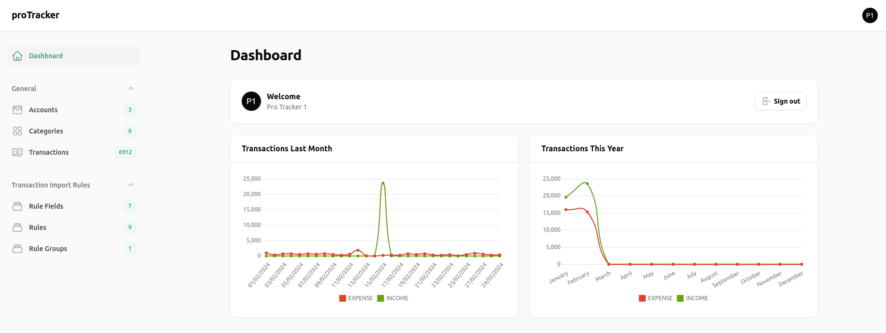
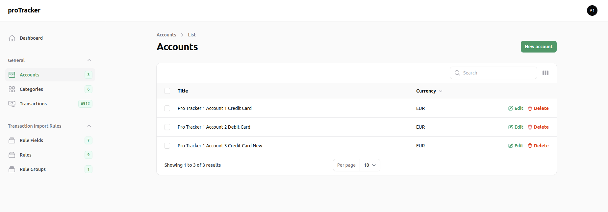
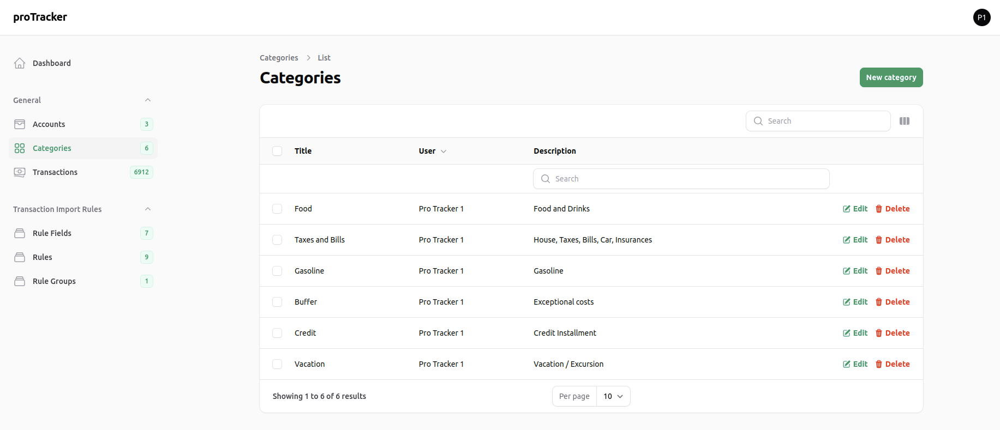
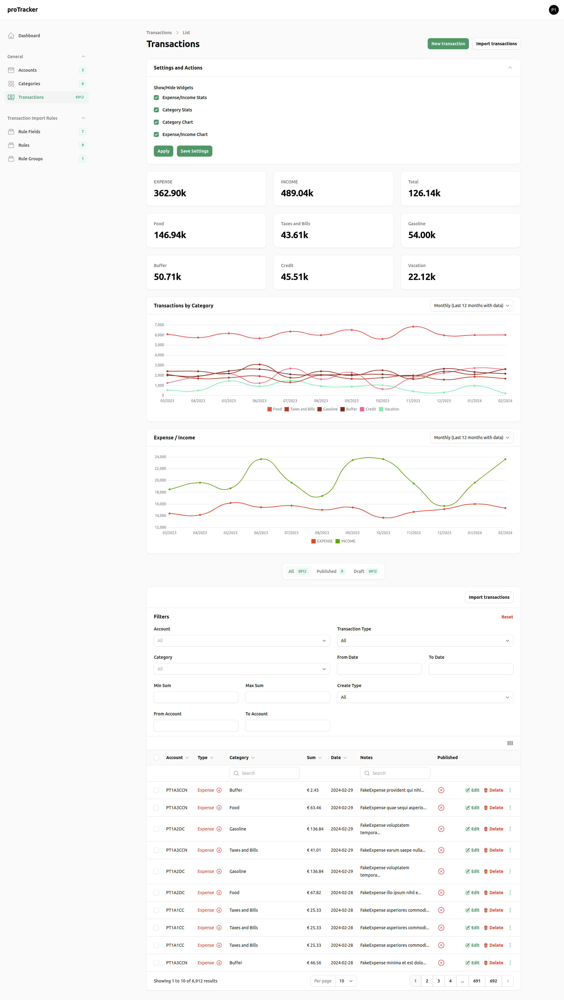

## proTracker App

You can keep your finances in order, track by account, type(expense/income), category, 
advanced filtering and reporting summaries, stats and charts, it's simple and straight forward.

At the moment this tool can be used/setup locally following the Installation instrictions.
After some features are ready and the App is polished I can publish an online demo.

### Dashboard

### Accounts

### Categories

### Transactions

## Supported Versions
- PHP `8.x`
- Laravel `10.x`
- Fillament `3.x`

## Installation

## Features

- <b>Rules</b> feature. There will be a separate page for creating/editing transaction rules. 
These rules will be available during importing transactions and could be used for applying bulk actions into the transactions table 
(mapping - type, category, combining fields, skip importing etc.).
- <b>Currency converting</b> feature. If there are accounts in different currencies 
we need to have a way to convert them into one currency. There will be a setting for choosing the 'main' currency.
- <b>Imports</b> page. There will be Imports page with all successful/unsuccessful imports and 
transactions related ot it. There will be logs/information about errors/issues during the import. 
- <b>CSV and PDF</b> exporting feature. Exporting of transactions, chrats and stats.
- <b>Save Filter</b> feature. There will be a functionality to save transaction filter 
and you'll be able to load all saved filters for better reporting user experience.
- <b>Save/Change User</b> settings feature. There will be different types of settings like show/hide stats 
and charts on the Transaction page, Choose main currency etc.
- <b>API</b> with CRUD operations for accounts/transactions/categories. There will be CSV import endpoint as well.
- <b>Dashboard changes</b> - there will be dynamic widgets that can be setup by the user into the User Settings Page.
- Fixing some small issues with the responsive design.

All advice, suggestions and help are welcome. 

## License

The MIT License (MIT). Please see [License File](LICENSE.md) for more information.
